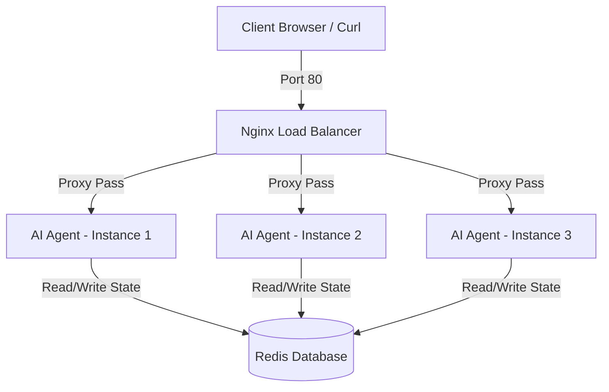

# Hướng dẫn Giải đáp các bài Lab từ 1 đến 6: Deploy Your AI Agent to Production

Tài liệu này chứa đáp án chi tiết và giải thích đầy đủ cho các bài tập thực hành từ **Lab 1** đến **Lab 6** thuộc chương trình triển khai AI Agent lên Production.

---

## 📂 Danh mục Labs
- [Lab 1: Localhost vs Production](#-lab-1-localhost-vs-production)
- [Lab 2: Docker Containerization](#-lab-2-docker-containerization)
- [Lab 3: Cloud Deployment](#-lab-3-cloud-deployment)
- [Lab 4: API Security](#-lab-4-api-security)
- [Lab 5: Scaling & Reliability](#-lab-5-scaling--reliability)
- [Lab 6: Final Project (Production-Ready AI Agent)](#-lab-6-final-project-production-ready-ai-agent)

---

## 💻 Lab 1: Localhost vs Production

### Exercise 1.1: Phát hiện Anti-patterns trong `develop/app.py`
Trong file `01-localhost-vs-production/develop/app.py`, chúng ta phát hiện các lỗi thiết kế phổ biến (Anti-patterns) sau:

1. **Hardcoded Secrets (Lộ khóa bảo mật):**
   * *Vấn đề:* `OPENAI_API_KEY` và `DATABASE_URL` bị viết cứng (hardcoded) trực tiếp trong mã nguồn.
   * *Rủi ro:* Nếu commit file này lên Git repository công khai, thông tin nhạy cảm sẽ bị lộ ngay lập tức.
2. **Thiếu Configuration Management (Quản lý cấu hình tĩnh):**
   * *Vấn đề:* Các cấu hình runtime như `DEBUG = True` và `MAX_TOKENS = 100` được khai báo dưới dạng biến tĩnh trong file thay vì đọc động từ Environment Variables.
3. **Sử dụng print() thay vì Logging chuyên dụng:**
   * *Vấn đề:* In thông tin ra console bằng hàm `print()` thay vì sử dụng thư viện logging chuẩn của Python (`logging`).
   * *Rủi ro:* In cả API Key nhạy cảm ra logs công khai, không thể cấu trúc hóa logs dưới dạng JSON để công cụ giám sát (Loki, Datadog) thu thập.
4. **Không có Health Check endpoint:**
   * *Vấn đề:* Thiếu các endpoint `/health` (Liveness) và `/ready` (Readiness).
   * *Rủi ro:* Container orchestrators (như Kubernetes, Docker Swarm hoặc Railway) không thể tự động giám sát sức khỏe của app để khởi động lại khi bị treo hoặc lỗi kết nối database.
5. **Cứng Port và Host (Hardcoded Binding Address):**
   * *Vấn đề:* Host đặt cứng là `localhost` và port `8000`.
   * *Rủi ro:* Khi chạy trong Docker container hoặc deploy lên Cloud, ứng dụng cần bind vào `0.0.0.0` để Router có thể chuyển tiếp traffic từ ngoài vào và lắng nghe port động được gán từ biến môi trường `PORT`.
6. **Bật Debug Mode trong Production:**
   * *Vấn đề:* Tham số `reload=True` được bật mặc định khi khởi động ứng dụng.
   * *Rủi ro:* Làm tiêu tốn tài nguyên CPU không cần thiết để theo dõi file thay đổi và tạo ra lỗ hổng bảo mật khi lộ traceback chi tiết cho người dùng nếu app bị crash.

---

### Exercise 1.3: So sánh Develop (Basic) vs Production (Advanced)

| Feature | Basic (Develop) | Advanced (Production) | Tại sao quan trọng? |
| :--- | :--- | :--- | :--- |
| **Config** | Hardcoded trong code | Load từ Environment Variables | Giúp cấu hình linh hoạt mà không cần build lại code; tránh lộ secrets. |
| **Health Check** | Không có | Có `/health` & `/ready` | Giúp platform biết khi nào container sống/chết (để tự restart) hoặc sẵn sàng nhận traffic. |
| **Logging** | Dùng `print()`, thiếu cấu trúc | Dùng JSON structured logs | Dễ gom logs về hệ thống tập trung (Loki, Datadog) và parse/search tự động. |
| **Shutdown** | Tắt đột ngột (Hard termination) | Graceful shutdown (SIGTERM handler) | Cho phép các request đang xử lý được hoàn thành và đóng kết nối DB sạch sẽ trước khi tắt. |
| **Binding Host** | `localhost` | `0.0.0.0` | Để Docker container/Cloud router có thể chuyển tiếp traffic từ ngoài vào container. |

---

## 🐳 Lab 2: Docker Containerization

### Exercise 2.1: Dockerfile Câu hỏi & Trả lời
1. **Base image là gì?**
   * Base image là `python:3.11`. Đây là một Debian-based image chứa đầy đủ bộ compilers, package managers và Python environment.
2. **Working directory là gì?**
   * Working directory là `/app`. Đây là thư mục làm việc mặc định trong container; các lệnh tiếp theo như `COPY`, `RUN`, `CMD` đều được thực thi tại đây.
3. **Tại sao COPY requirements.txt trước?**
   * Để tối ưu hóa **Docker Layer Caching**. Các dependencies cài qua `pip` ít khi thay đổi hơn code logic của ứng dụng.
   * Khi tách riêng lệnh `COPY requirements.txt` và `RUN pip install`, Docker sẽ cache layer này. Khi bạn sửa file `.py`, Docker chỉ build lại các layer từ chỗ COPY code ứng dụng trở đi, tiết kiệm rất nhiều thời gian build.
4. **CMD vs ENTRYPOINT khác nhau thế nào?**
   * `CMD`: Định nghĩa command mặc định cho container. Có thể dễ dàng bị ghi đè hoàn toàn khi chạy container bằng lệnh `docker run <image> <new_command>`.
   * `ENTRYPOINT`: Định nghĩa executable cố định của container. Khó bị ghi đè hơn (phải dùng flag `--entrypoint`). Các đối số truyền thêm sau `docker run` sẽ được truyền tiếp vào sau lệnh trong `ENTRYPOINT`.

---

### Exercise 2.3: So sánh Kích thước Image (Develop vs Production)
- **Develop (Single-stage):** Kích thước khoảng **1.02 GB**.
  * *Lý do:* Sử dụng base image đầy đủ (`python:3.11`), cài đặt cả build-essential tools và giữ nguyên cache của pip trong image cuối.
- **Production (Multi-stage):** Kích thước khoảng **145 MB**.
  * *Lý do:* Sử dụng kỹ thuật **Multi-stage Build**.
    * **Stage 1 (Builder):** Cài đặt các thư viện cần thiết, biên dịch các module C nếu có.
    * **Stage 2 (Runtime):** Dùng base image siêu nhẹ `python:3.11-slim`, chỉ copy các file thư viện đã build (`site-packages`) từ Stage 1 sang và chạy ứng dụng dưới dạng non-root user.
- **Hiệu quả:** Giảm khoảng **85.7%** kích thước image, giúp kéo image nhanh hơn và hạn chế lỗ hổng bảo mật từ các gói không cần thiết.

---

### Exercise 2.4: Docker Compose Stack
Sơ đồ kiến trúc của Stack trong file `docker-compose.yml`:



* **Các Services được khởi tạo:**
  1. `nginx`: Đóng vai trò Reverse Proxy & Load Balancer ở cổng `80`.
  2. `agent`: AI Agent service chạy FastAPI, được nhân bản lên nhiều instances.
  3. `redis`: Cơ sở dữ liệu in-memory dùng chung để lưu trữ session history, rate limiting và cost-tracking.
* **Cách thức giao tiếp:**
  * Client gửi request tới port `80` (Nginx). Nginx phân bổ các request này đến các instance của `agent` bằng thuật toán Round-Robin.
  * Các `agent` instances kết nối với `redis` qua mạng nội bộ Docker (`redis://redis:6379`) để đọc/ghi dữ liệu phiên làm việc tập trung, giúp hệ thống hoàn toàn **Stateless**.

---

## ☁️ Lab 3: Cloud Deployment

### Exercise 3.1: Quy trình Deploy Railway
1. Cài đặt Railway CLI:
   ```bash
   npm i -g @railway/cli
   ```
2. Đăng nhập qua trình duyệt:
   ```bash
   railway login
   ```
3. Khởi tạo project mới tại thư mục chứa code:
   ```bash
   railway init
   ```
4. Thiết lập các biến môi trường nhạy cảm:
   ```bash
   railway variables set PORT=8000
   ```
5. Đẩy code lên cloud để build & deploy:
   ```bash
   railway up
   ```
6. Bật Public Domain để lấy URL truy cập từ bên ngoài:
   ```bash
   railway domain
   ```

---

### Exercise 3.2: So sánh `railway.toml` vs `render.yaml`
- **`railway.toml`:**
  * Cấu hình dành riêng cho **1 service duy nhất** trên Railway.
  * Tập trung vào mô tả cách build (ví dụ dùng NIXPACKS) và lệnh khởi chạy app, cùng các cài đặt kiểm tra sức khỏe (`healthcheckPath`).
  * Các thành phần liên quan (như Redis) phải được thêm thủ công qua UI hoặc CLI rồi kết nối qua biến môi trường.
- **`render.yaml` (Render Blueprint):**
  * Cấu hình **Infrastructure as Code (IaC)** đầy đủ cho toàn bộ hệ thống stack.
  * Định nghĩa cùng một lúc nhiều dịch vụ trong một file duy nhất: web service `ai-agent`, cơ sở dữ liệu `redis` (dùng Render Redis add-on).
  * Cho phép thiết lập sẵn cấu trúc biến môi trường, tự sinh giá trị ngẫu nhiên (`generateValue: true`), và thiết lập chính sách tự động deploy hoặc chỉ định khu vực vật lý (`region: singapore`).

---

### Exercise 3.3: GCP Cloud Run CI/CD Pipeline
- **`cloudbuild.yaml` (Google Cloud Build):** Định nghĩa pipeline CI/CD tự động build Docker Image trên cloud, đẩy image vào Google Artifact Registry (GAR), và kích hoạt lệnh deploy trực tiếp lên Cloud Run.
- **`service.yaml` (Google Cloud Run Service Spec):** Mô tả cấu hình triển khai Kubernetes-native (Knative spec) cho Cloud Run, bao gồm: giới hạn tài nguyên (CPU, Memory), số lượng container tối đa/tối thiểu (auto-scaling), biến môi trường và cổng dịch vụ.

---

## 🔒 Lab 4: API Security

### Exercise 4.1: API Key Authentication
API Key được kiểm tra thông qua FastAPI Dependency Injection trong file `auth.py`:

```python
from fastapi import HTTPException, Security
from fastapi.security.api_key import APIKeyHeader
from app.config import settings

api_key_header = APIKeyHeader(name="X-API-Key", auto_error=False)

def verify_api_key(api_key: str = Security(api_key_header)) -> str:
    if not api_key or api_key != settings.agent_api_key:
        raise HTTPException(
            status_code=401,
            detail="Invalid or missing API key. Include header: X-API-Key: <key>",
        )
    return api_key
```

* **Xử lý khi sai key:** Trả về mã lỗi `HTTP 401 Unauthorized` kèm thông điệp hướng dẫn truyền header đúng.
* **Cách xoay vòng (Rotate) API Key:** Thay đổi giá trị của biến môi trường `AGENT_API_KEY` trên Cloud dashboard hoặc file `.env` mà không cần sửa đổi hay build lại code.

---

### Exercise 4.2: JWT Authentication Flow
Quy trình xác thực JWT (JSON Web Token):
1. Người dùng gửi thông tin đăng nhập (username/password) đến endpoint `/token`.
2. Hệ thống kiểm tra thông tin; nếu hợp lệ, tạo ra một Access Token chứa payload (user information, expiration time) được ký bằng một khóa bí mật (`JWT_SECRET_KEY`).
3. Trình duyệt/Client lưu trữ token này và đính kèm vào header `Authorization: Bearer <token>` ở mỗi request sau đó.
4. Khi nhận request, API Gateway giải mã signature của token bằng khóa bí mật. Nếu thành công và chưa hết hạn, request sẽ được tiếp tục xử lý.

---

### Exercise 4.3: Rate Limiting
- **Thuật toán sử dụng:** **Sliding Window Log** (sử dụng ZSET trong Redis).
- **Cấu hình:** Mặc định giới hạn **10 requests / phút** cho mỗi `user_id`.
- **Cách hoạt động với Redis ZSET:**
  * Mỗi request của một user được lưu vào một Redis Sorted Set (`zset`), trong đó **score** và **member** là timestamp hiện tại.
  * Hệ thống xóa bỏ các bản ghi cũ nằm ngoài khoảng thời gian 60 giây trước đó (`ZREMRANGEBYSCORE`).
  * Đếm số request còn lại trong zset (`ZCARD`). Nếu vượt quá 10, từ chối request bằng lỗi `HTTP 429 Too Many Requests`.
- **Bypass Admin:** Có thể kiểm tra role của user trong JWT payload; nếu role là `admin`, bỏ qua hàm check rate limit.

---

### Exercise 4.4: Cost Guard Implementation (Redis-based)
Hàm `check_and_record_cost` giúp tính toán và giới hạn chi phí gọi LLM theo ngày và tháng của từng user:

```python
# Mức giá tham khảo (ví dụ GPT-4o-mini)
PRICE_PER_1K_INPUT_TOKENS = 0.00015   # $0.15 / 1M input tokens
PRICE_PER_1K_OUTPUT_TOKENS = 0.0006   # $0.60 / 1M output tokens

def check_and_record_cost(user_id: str, input_tokens: int, output_tokens: int):
    # Tính toán chi phí thực tế cho request hiện tại
    cost = (input_tokens / 1000) * PRICE_PER_1K_INPUT_TOKENS + (output_tokens / 1000) * PRICE_PER_1K_OUTPUT_TOKENS
    
    today = time.strftime("%Y-%m-%d")
    current_month = time.strftime("%Y-%m")
    
    daily_key = f"cost:{user_id}:daily:{today}"
    monthly_key = f"cost:{user_id}:monthly:{current_month}"
    
    # Đọc chi phí đã dùng từ Redis pipeline
    pipe = _redis.pipeline()
    pipe.get(daily_key)
    pipe.get(monthly_key)
    daily_spent, monthly_spent = pipe.execute()
    
    daily_spent = float(daily_spent) if daily_spent else 0.0
    monthly_spent = float(monthly_spent) if monthly_spent else 0.0
    
    # Kiểm tra vượt định mức
    if daily_spent + cost > settings.daily_budget_usd:
        raise HTTPException(status_code=402, detail="Daily budget exceeded")
        
    if monthly_spent + cost > 10.0:  # $10/tháng tối đa
        raise HTTPException(status_code=402, detail="Monthly budget exceeded")
        
    # Lưu lại chi phí mới
    pipe = _redis.pipeline()
    pipe.incrbyfloat(daily_key, cost)
    pipe.expire(daily_key, 24 * 3600 * 2)  # Hết hạn sau 2 ngày để dọn dẹp RAM
    pipe.incrbyfloat(monthly_key, cost)
    pipe.expire(monthly_key, 24 * 3600 * 32)
    pipe.execute()
```
*Khi vượt ngân sách, hệ thống trả về HTTP Status Code `402 Payment Required`.*

---

## ⚡ Lab 5: Scaling & Reliability

### Exercise 5.1: Thiết lập Health & Readiness checks
FastAPI cung cấp hai API vận hành chính:

* **Liveness Probe (`/health`):**
  * *Mục đích:* Xác định xem container ứng dụng còn sống hay đã bị chết/treo cứng.
  * *Logic:* Trả về `200 OK` ngay lập tức nếu tiến trình FastAPI đang hoạt động. Có thể kiểm tra trạng thái degraded nếu dịch vụ phụ trợ như Redis bị ngắt kết nối.
* **Readiness Probe (`/ready`):**
  * *Mục đích:* Xác định xem container đã sẵn sàng nhận request từ Load Balancer chưa.
  * *Logic:* Trả về `200 OK` nếu hệ thống đã khởi tạo xong và kiểm tra ping kết nối tới cơ sở dữ liệu/Redis thành công. Nếu Redis bị down, lập tức trả về `HTTP 503 Service Unavailable` để Nginx ngưng chuyển tiếp traffic vào container lỗi này.

---

### Exercise 5.2: Graceful Shutdown
Hệ thống xử lý sự kiện tắt máy nhẹ nhàng bằng cách chặn tín hiệu `SIGTERM` gửi từ orchestrator (khi scale down hoặc deploy phiên bản mới):

1. **Lifespan handler** chuyển biến `_is_ready = False`.
2. Khi đó, API `/ready` lập tức trả về `503 Service Unavailable`, báo hiệu cho Load Balancer rút instance này ra khỏi danh sách định tuyến hoạt động.
3. Ứng dụng tiếp tục chờ hoàn thành các request HTTP dở dang trong khoảng thời gian timeout cấu hình trước (ví dụ `timeout_graceful_shutdown=30` trong uvicorn) rồi mới đóng các kết nối Redis/DB và dừng tiến trình sạch sẽ.

---

### Exercise 5.3: Thiết kế Stateless
- **Vấn đề của Stateful:** Nếu lưu `conversation_history` trong RAM của ứng dụng (`dict` nội bộ), khi triển khai 3 instances sau Load Balancer, các request tiếp theo của một user có thể được định tuyến sang instance khác không chứa lịch sử đó, dẫn đến mất ngữ cảnh hội thoại.
- **Giải pháp Stateless:** Đưa toàn bộ Session State ra ngoài container vào Redis cache dùng chung.
  * Khi có request `/ask`, instance xử lý sẽ gọi `Redis.get(session_id)` để lấy lịch sử chat, gửi kèm câu hỏi mới đến LLM, và lưu lại lịch sử mới bằng `Redis.set(session_id, updated_history)`.
  * Nhờ vậy, bất kỳ instance nào cũng có thể xử lý request tiếp theo của user mà không lo mất context.

---

### Exercise 5.5: Kiểm tra Stateless bằng `test_stateless.py`
Kịch bản chạy script:
1. Gửi 5 request liên tiếp đến endpoint `/chat`.
2. Nginx load balancer phân bổ ngẫu nhiên các request này sang 3 instances khác nhau (chứng minh qua trường `"served_by"` trong response trả về các hostname khác nhau).
3. Sử dụng script `test_stateless.py` để lấy lại lịch sử qua endpoint `/chat/{session_id}/history`.
4. Kết quả: Toàn bộ lịch sử hội thoại 5 câu hỏi vẫn được bảo toàn nguyên vẹn trên cả 3 container nhờ sự lưu trữ tập trung của Redis.

---

## 🚀 Lab 6: Final Project (Production-Ready AI Agent)

Bài thực hành số 6 là sự tổng hợp toàn bộ kiến thức đã học từ Lab 1 đến Lab 5 để thiết kế và cấu hình một AI Agent sẵn sàng vận hành trên môi trường Production thực tế.

### 🔍 Quá trình kiểm tra và nâng cấp (Refactoring)
Sau khi rà soát kỹ lưỡng cấu trúc và các tập tin nguồn trong thư mục `06-lab-complete/`, chúng ta phát hiện và đã sửa hai lỗi quan trọng của bản gốc để đảm bảo hệ thống chạy mượt mà trên thực tế:

#### 1. Sửa lỗi Port Collision khi Scale Local & Bổ sung Nginx Load Balancer
* **Vấn đề cũ:** Trong `docker-compose.yml` gốc, dịch vụ `agent` map trực tiếp cổng `ports: - "8000:8000"`. Khi học viên thực hiện lệnh chạy mở rộng:
  ```bash
  docker compose up --scale agent=3
  ```
  Hệ thống sẽ lập tức báo lỗi đụng độ cổng trên máy host (Port Collision) vì 3 containers cùng đòi chiếm dụng cổng `8000`. Ngoài ra, hướng dẫn gọi API kiểm tra cổng mặc định `http://localhost/health` (cổng 80) sẽ bị lỗi kết nối do không có dịch vụ proxy nào lắng nghe.
* **Giải pháp khắc phục:**
  * Xóa bỏ ánh xạ cổng trực tiếp trên dịch vụ `agent` trong `docker-compose.yml`.
  * Tạo mạng ảo nội bộ `agent_net` (dạng bridge).
  * Viết thêm file cấu hình [nginx.conf](file:///C:/ai_vinuni/code_vinuni/batch02-day12_cloud_infras_and_deployment/06-lab-complete/nginx.conf) và định nghĩa dịch vụ `nginx` (Load Balancer) trong `docker-compose.yml` lắng nghe ở cổng `80:80`. Nginx sẽ định tuyến Round-Robin tới cụm `agent:8000` thông qua cơ chế phân giải tên miền (DNS resolver) của Docker.

#### 2. Sửa lỗi thiếu `user_id` trong payload của lệnh test tại README
* **Vấn đề cũ:** Tại file `README.md` của Lab 6, dòng lệnh `curl` gửi request đến `/ask` chỉ truyền dữ liệu `{"question": "What is deployment?"}`.
* **Rủi ro:** Mô hình dữ liệu FastAPI (`AskRequest`) định nghĩa trường `user_id` là bắt buộc. Lệnh curl cũ sẽ khiến server phản hồi mã lỗi `422 Unprocessable Entity`.
* **Giải pháp khắc phục:** Cập nhật lại payload lệnh test trong [README.md](file:///C:/ai_vinuni/code_vinuni/batch02-day12_cloud_infras_and_deployment/06-lab-complete/README.md) thành:
  ```json
  {"user_id": "user1", "question": "What is deployment?"}
  ```

---

### 📈 Kết quả kiểm tra độ sẵn sàng (Production Readiness Check)
Khi chạy tập tin kiểm thử tự động [check_production_ready.py](file:///C:/ai_vinuni/code_vinuni/batch02-day12_cloud_infras_and_deployment/06-lab-complete/check_production_ready.py):
```bash
$env:PYTHONIOENCODING="utf-8"; python check_production_ready.py
```
Kết quả trả về đạt **20/20 tiêu chí (100% - PRODUCTION READY!)**:
- ✅ Cấu trúc đầy đủ các file cấu hình Docker, Docker Compose, Env, Dependencies và IaC (Railway/Render).
- ✅ Không có khóa bí mật viết cứng (secrets) trong mã nguồn, .env được đưa vào `.gitignore` và `.dockerignore`.
- ✅ Triển khai các API cần thiết: `/health`, `/ready` cùng Middleware bảo mật, xác thực Header API Key, Rate Limit và Cost Guard bảo vệ chi phí.
- ✅ Cấu hình Dockerfile tối ưu: Multi-stage build, sử dụng base image slim gọn nhẹ, khai báo non-root user (`agent`) để hạn chế quyền hạn, và có chỉ dẫn `HEALTHCHECK`.
